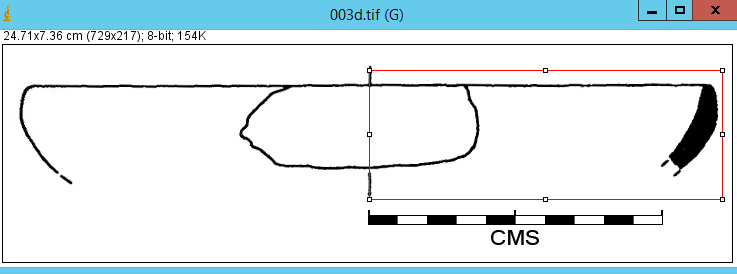

## Instructions for using ImageJ with Profile Drawings

The goal of using ImageJ is to create mathematical outlines of the ceramic profiles.  We will start with rim profiles.  Rim profiles show what the ceramic looks like when cut into a section.  For our purposes, we only want to use the right hand side of the profile:

This gives us a picture of what half of the ceramic looked like.  In most cases, the rim is broken at the bottom, in which case, we want to end up with a mathematical outline that is open at the broken end.  If the ceramic is complete, we will want a closed outline of half the vessel.

---

Here are the steps:
 * open the ImageJ program (Microscope Icon at bottom)
 * Press the button labeled ‘0’, which is located under the ‘Window’ menu.  This button is only used once when the ImageJ program is started, and isn’t used after that.
    * After this button is pressed, the program will prompt you to open a new file.  We are currently working on the .tif images in this folder:
    * C:\inetpub\wwwroot\citation\finds
    * go to that folder if it doesn’t automatically open there
 * Select whichever is the next .tif file for you to work on.  Work on the tif files in order.
 * After the file opens, make sure the ceramic is a rim with a center line.  If not, move to the next file by clicking the ‘N’ button at the top of ImageJ.  Remember that some ceramics that have rims don’t have a center line.
 * Check the scale.  One unit should be one centimeter.  If you hover your mouse over the left edge of the CMS Scale bar, you will see a value in the main ImageJ window for x, remember this, then move one centimeter to the right with your mouse.  Look again at x.  It should have incremented by about 1 unit.
 * Next, prepare to crop the image to the right side of the ceramic by using the rectangle tool (automatically enabled) to select a rectangle from the center line.  Split the center line itself in the middle.

