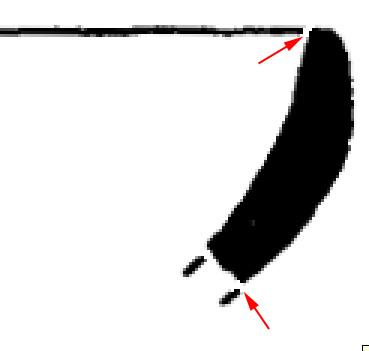
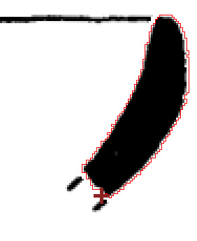
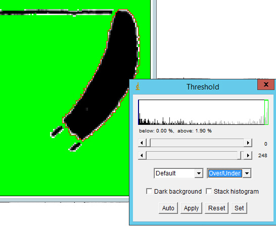

## Instructions for using ImageJ with Profile Drawings

The goal of using ImageJ is to create mathematical outlines of the ceramic profiles.  We will start with rim profiles.  Rim profiles show what the ceramic looks like when cut into a section.  For our purposes, we only want to use the right hand side of the profile:

This gives us a picture of what half of the ceramic looked like.  In most cases, the rim is broken at the bottom, in which case, we want to end up with a mathematical outline that is open at the broken end.  If the ceramic is complete, we will want a closed outline of half the vessel.

---

Before using ImageJ, you should copy the StartupMacros.txt script into the proper folder (See ImageJ manual)

Here are the steps:
 * open the ImageJ program (Microscope Icon at bottom)
 * Press the button labeled ‘0’, which is located under the ‘Window’ menu.  This button is only used once when the ImageJ program is started, and isn’t used after that.
    * After this button is pressed, the program will prompt you to open a new file.  We are currently working on the .tif images in this folder:
    * C:\inetpub\wwwroot\citation\finds
    * go to that folder if it doesn’t automatically open there
 * Select whichever is the next .tif file for you to work on.  Work on the tif files in order.
 * After the file opens, make sure the ceramic is a rim with a center line.  If not, move to the next file by clicking the ‘N’ button at the top of ImageJ.  Remember that some ceramics that have rims don’t have a center line.
 * Check the scale.  One unit should be one centimeter.  If you hover your mouse over the left edge of the CMS Scale bar, you will see a value in the main ImageJ window for x, remember this, then move one centimeter to the right with your mouse.  Look again at x.  It should have incremented by about 1 unit.
 * Next, prepare to crop the image to the right side of the ceramic by using the rectangle tool (automatically enabled) to select a rectangle from the center line.  Split the center line itself in the middle.

 * Press the ‘C’ button to crop.
 * Now click on the image to zoom in (the magnifier tool is automatically enabled)
 * Press the Pencil button at the top.  Clean up the section so that the rim is left unattached to anything else.  Move in smooth brush strokes and if you delete too much, hit undo.

 * The next part is the most important.  You will select the outline of the rim section.
 * First, you will try to automatically select the outline using the wand tool at the top.  You must place the wand tool just to the left of the bottom most point on the exterior of the rim (see the red + below).  Hopefully in most cases, this will just work.  However, in many cases, the red selection outline will not follow the rim section the way you want, or there may be small pieces of the rim that need to be cleaned up.  You can use the pencil to make small cleanups on the rim, but don’t delete too much. 

 * If the selection tool does not work automatically, if it selects much more than just the rim, you must turn on a threshold first.  This tool is located under the Image Menu - Adjust - Threshold.  Set the second dropdown box to Over/Under, then scroll the second bar to the right until you see all of the ceramic’s section in black.  Now you can try the wand again.

 * We want this red selection line to match the outline of the ceramic very carefully, but also be smooth and accurate.  Always ask if you run into a problem.
 * Next press the ‘L’ button to convert this into an editable line.  A box will come up asking about interpolation number.  This is the number of pixels interpolated to make the line.  More pixels will make a smoother line, but will cut off the edges.  Less pixels will have too many irregularities.  The selection line should seem to smoothly follow the ceramic section.  The default is 3.  You can easily experiment with different values, because you can always go back to 3.  You can use values like 0.2, 1, 4, etc.  Once you are happy with the smooth line, select 0 to continue.
 * You will now get a line with control points.  We can adjust these control points to complete the correct section.  At the bottom, for a broken ceramic, we want to delete control points to open up the bottom, and make sure that the edges are headed in the broken direction.  First, zoom into the bottom, then select the line tool at the top.  To move a control point, just use the left mouse button and drag.  To delete a control point, hold down the alt key then click the left mouse button.  To add a point, hold down the shift key then click the left mouse button on a nearby point.

 * The top can also often use some slight adjustments to be fully inclusive of the ceramic.  Make sure all adjustments end up smooth and follow the rim outline exactly.
 * Press the ‘P’ button on top to get the list of points.  Click File- Save As to save the points.  You’ll need to move into the points subfolder in order to save the points.  Make sure the file is a .csv.  Change the name of the file so it more closely matches the name of the tif file, but removing the ‘XY_’ from the beginning.  Then save.  Close the coordinates popup box.
 * Click the ‘N’ button at the top to move to the next image.  If it prompts you asking to save, click No.
